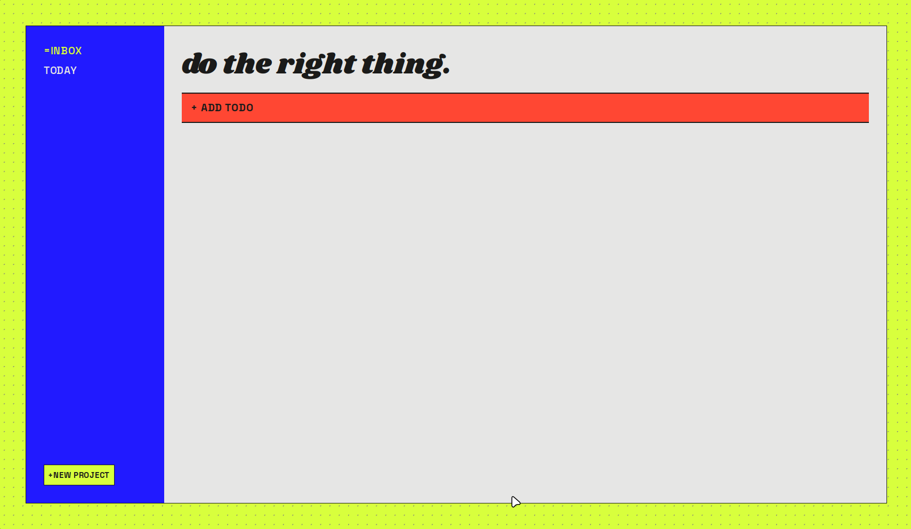
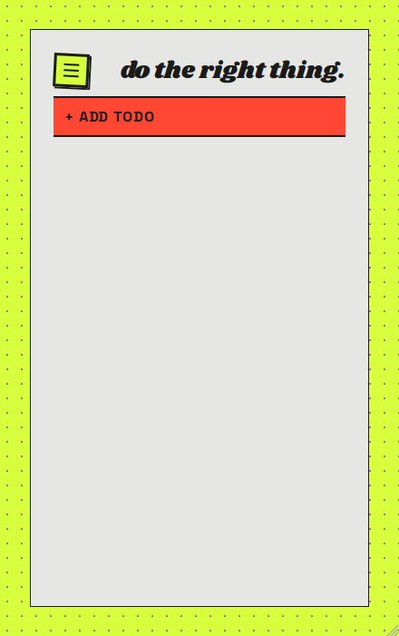
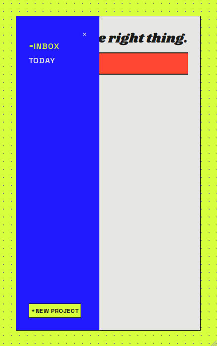

# abound

For managing the abundance of to-dos that get left around.





<!-- TOC -->

## Table of Contents

- [Table of Contents](#table-of-contents)
- [Preview](#preview)
- [Features](#features)
- [Developer's Note](#developers-note)
- [Acknowledgments](#acknowledgments)
- [License](#license)

<!-- /TOC -->

## Preview

[View Live Demo](https://calsjunior.github.io/abound/)

## Features

- To-dos are grouped into specific projects that they were created in.
- Includes default projects like Inbox for displaying all to-dos, and Today for
  displaying all to-dos due today using the Temporal API.
- Saves your to-dos and projects with `localStorage` using the Web Storage API.
- Toggle to-dos to mark them as complete, or delete them.
- Visual indicators for different priority tasks.
- Responsive design.

## Developer's Note

I had a problem when making previous vanilla JavaScript applications. It was
that the logic had to live in two different places, the HTML file for creating
the DOM, and JS files for querying and manipulating them. While this was
straightforward and simple for small projects, it was getting hectic when trying
to make a sensibly scaled application.

### Back and Forth

While the standard way of manipulating the DOM by querying was fun, if I decided
that the class or id name for a tag doesn't suit my taste, I would have to
change them in both places, the `.html`, and `.js` files. So to combat this, I
found and modified a function, `./src/utils/dom.js`, to create the DOM using
pure JavaScript with no querying involved which makes the logic unified.

### Rendering

Well, now that creating elements is easy, how should one get them to render?
Good question, me. For this particular project, all things related to rendering
would live in `./src/components/` with their own specific files. For instance,
the logic for rendering the to-do list (displaying to-dos) lives in
`./src/components/TodoList.js`, and it has no idea about the concept of the
`ProjectList` that lives in a different file.

### Controlling Events

Okay, then how the heck do you get a dialog to pop up on click, or update the
project or to-do lists once you add a new one? Another good question, me. To
accomplish these tasks, I had to use a pattern called `Publisher and Subscriber
Pattern`. For more knowledge, read [here.](https://jsguides.dev/tutorials/javascript-design-patterns/dp-observer-pattern/)

This pattern is particularly great at decoupling logic so that the projects do
not need to know about the to-dos and vice versa. If you want to see how it
works, you can check out how I used it for this project in these files as
examples: `./src/components/TodoList.js` and
`./src/controllers/TodoControllers.js`.

Here's a short snippet of them:

```js
renderButton() {
    return createElement(
      "button",
      {
        classes: ["todo__button"],
        onClick: () => this.eventBus.publish(EVENTS.UI.ADD_TODO_CLICKED),
      },
      "Add Todo",
    );
  }
```

Notice that I am using the custom `createElement` function to create a `button`
with a class called `todo__button`. The button also has an `eventListener` on it
where I made use of the `onClick` property instead of doing a
`button.addEventListener`. Now the special thing about this is that, upon
clicking the button, the button fires an event called `ADD_TODO_CLICKED`. It has
absolutely no idea what that means or does; it just shouts it out to the world.

Inside the controller file listed above:

```js
this.eventBus.subscribe(EVENTS.UI.ADD_TODO_CLICKED, () => {
  this.dialog.open();
});
```

The controller is the one that, well, controls the application. So when it hears that
`ADD_TODO_CLICKED`, it will open a dialog as per the written code. Pretty cool,
huh?

### Performance

While everything feels cleaner than querying, in my opinion, there ought to be
some performance drawbacks from creating elements with pure JavaScript. Now I
could sit here and learn to create a basic React project from scratch to improve
the performance, but then I would be sitting here forever.

For now, this approach keeps the logic unified, and the components decoupled,
which is what I care about most.

## Acknowledgments

This project was completed as a part of [The Odin
Project's](https://www.theodinproject.com/lessons/node-path-javascript-todo-list)
JavaScript curriculum.

## License

[MIT (c) Calsjunior](LICENSE)
